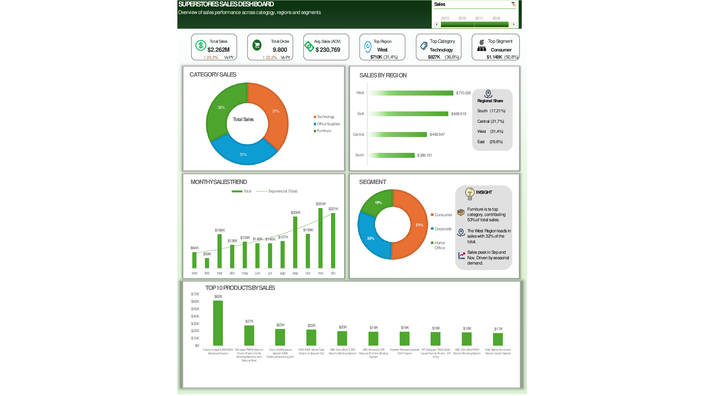

# Data Analytics Portfolio

Hello, I'm Anguie.

This repository contains data analytics projects where I use:

- Python
- SQL
- Power BI
- Excel

## Projects

### 1. Superstore Sales Dashboard

An interactive sales dashboard built in Excel using the Superstore dataset.

#### Key Metrics
- Total Sales
- Total Orders
- Average Order Value (AOV)
- Top Region
- Top Category
- Top Segment

#### Dashboard Features
- Sales by Category Analysis
- Sales by Region Analysis
- Monthly Sales Trend
- Customer Segment Analysis
- Top 10 Products by Sales
- Interactive Year Timeline Filter

#### Tools Used
- Microsoft Excel
- Pivot Tables
- Pivot Charts
- Timeline Filters
- Conditional Formatting
- Dashboard Design

## Skills Demonstrated

- Data Cleaning
- Data Visualization
- Dashboard Design
- KPI Development
- Pivot Tables
- Business Analysis
- Data Storytelling
  
#### Dataset
Superstore Sales Dataset

## About Me

I am an aspiring Data Analyst currently developing projects in:

- Excel
- SQL
- Power BI
- Python

My goal is to transform data into actionable business insights through data analysis and visualization.
